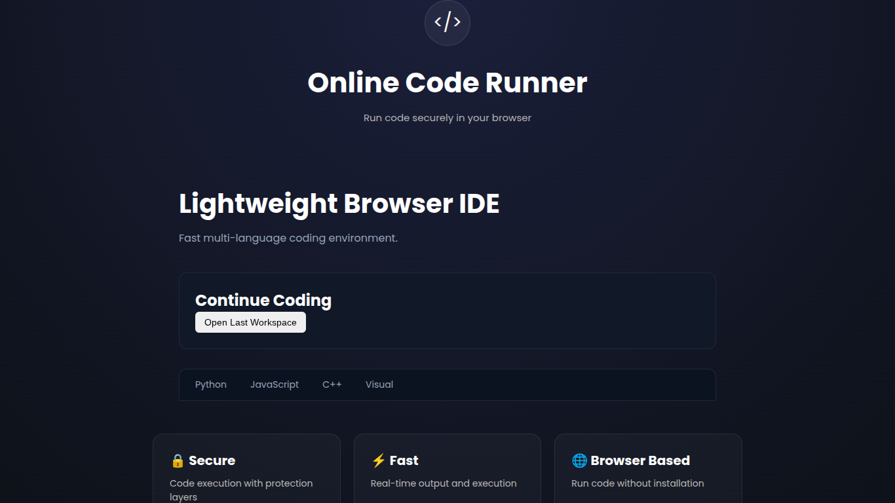
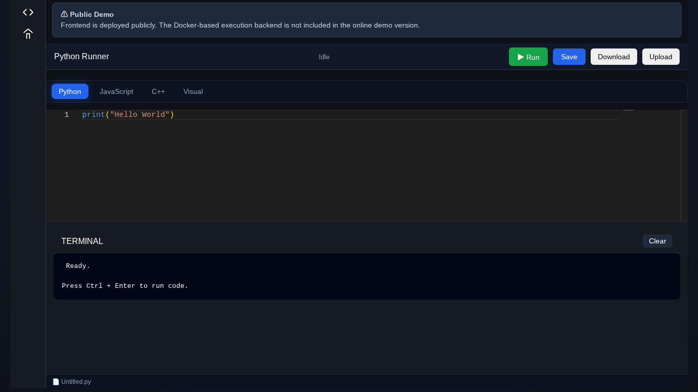
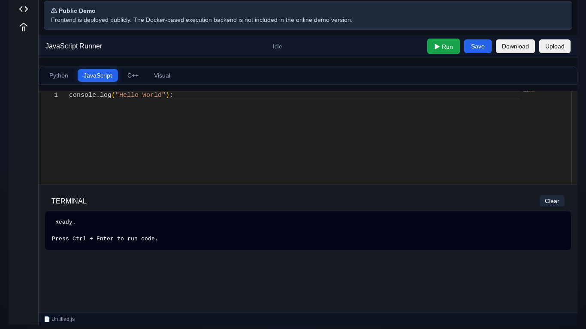
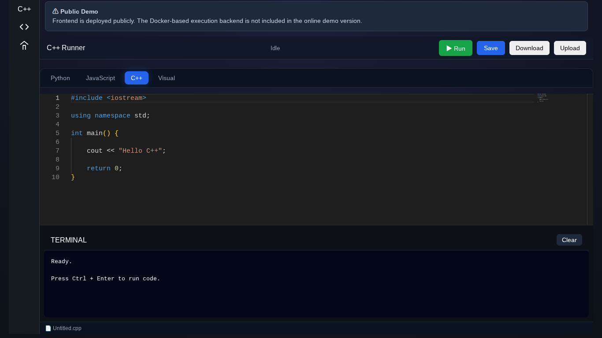

# Online Code Runner

## Features
- Python Execution
- JavaScript Execution
- C++ Execution
- Monaco Editor
- Upload Files
- Download Files
- Status Bar
- Visual Playground

## Tech Stack
- Flask
- Docker
- Monaco Editor
- HTML/CSS/JavaScript

## Run Locally

### Backend

pip install -r requirements.txt
python app.py

### Frontend

Open index.html

## Live Demo

https://your-vercel-url.vercel.app

## Note

The public demo showcases the frontend interface.

The backend uses Docker-based execution and is intended for local/VPS deployment.

## Screenshots

### Home Page

### Python Editor

### JavaScript Editor

### C++ Editor

